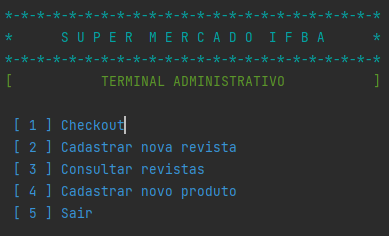
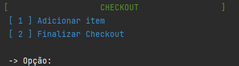
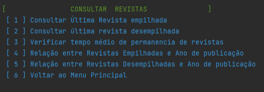
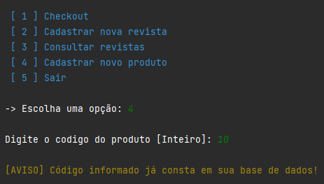

Aqui está a versão atualizada do README com as seções adicionais para Javadocs e execução:

---

# Supermercado IFBA

Este projeto é uma aplicação para um pequeno supermercado que oferece uma revista como brinde a cada R$ 100,00 de compra. O sistema permite o cadastro e manipulação de revistas e produtos, além de realizar o checkout das compras dos clientes.

## Funcionalidades

- **Cadastro e Manipulação de Revistas**: Permite o cadastro de revistas com título, número de edição, mês e ano de publicação, e número de volume. As revistas são empilhadas e podem ser consultadas ou retiradas durante o checkout.

- **Cadastro e Manipulação de Produtos**: Produtos com preços fixos são cadastrados e utilizados para calcular o valor total da compra.

- **Checkout**: Durante o checkout, o sistema calcula o valor total da compra e distribui as revistas de brinde com base no valor da compra.

## Produtos Disponíveis

Aqui estão os produtos disponíveis para compra e seus respectivos preços:

```
0001;Açúcar Refinado 1Kg;2,15
0002;Detergente Líquido Incolor 500ml;1,39
0003;Nuggets Tradicional 300g;5,98
0004;Água Sanitária 2L;3,98
0005;Extrato de Tomate 340g;3,74
0006;Óleo de Soja 900ml;3,10
0007;Amaciante 2L;11,58
0008;Farinha de Trigo 1Kg;2,28
0009;Pão de Forma Tradicional 500g;5,85
0010;Arroz Branco 5Kg;13,98
0011;Feijão 1Kg;3,28
0012;Papel Higiênico 30m 4un;6,45
0013;Azeite Tipo Extravirgem 500ml;17,90
0014;Gim 750ml;89,90
0015;Refrigerante 1,5L;5,49
0016;Barra de Chocolate 135g;5,99
0017;Hambúrguer de Frango e Boi 672g;12,75
0018;Requeijão Cremoso Tradicional 200g;2,99
0019;Bolacha Recheada de Chocolate 136g;1,88
0020;Iogurte de Morango 40g 8un;3,99
0021;Sabão em Pó 1Kg;7,99
0022;Bombons Sortidos 300g;7,98
0023;Lã de Aço 60g 8un;1,86
0024;Sabonete 90g;1,22
0025;Café em Pó Tradicional 500g;11,88
0026;Leite Condensado 395g;3,98
0027;Sal Refinado 1Kg;2,19
0028;Cerveja 350ml;2,39
0029;Leite UHT Integral 1L;2,18
0030;Sorvete Napolitano 1,5L;17,50
0031;Cerveja 500ml;12,70
0032;Macarrão com Ovos Parafuso 500g;2,65
0033;Suco Pronto para Consumo Néctar 1L;4,92
0034;Creme de Avelã 350g;17,90
0035;Macarrão Espaguete 500g;6,49
0036;Uísque 12 Anos 750ml;117,90
0037;Creme de Leite 200g;2,49
0038;Maionese 500g;4,98
0039;Vodca 998ml;29,90
```

## Executando o Projeto

Para rodar o projeto localmente, siga os passos abaixo:

1. **Clone o Repositório**:

   ```bash
   git clone <url-do-repositorio>
   cd <nome-do-repositorio>
   ```

2. **Compile o Projeto**:

   Certifique-se de ter o Java instalado e configure seu ambiente:

   ```bash
   javac -d bin src/*.java
   ```

3. **Execute a Aplicação**:

   Navegue até o diretório `bin` e execute a aplicação:

   ```bash
   java App
   ```

## Javadocs

Para acessar a documentação completa do projeto, visite [Javadocs do Projeto](https://franckallyson.github.io/ProjetoPraticoLPII/JavaDocProjeto/).

## Prints Demonstrativos

A seguir, apresentamos alguns prints demonstrativos do funcionamento da aplicação:

1. **Menu Principal**:

   

2. **Tela de Checkout**:

   

3. **Consulta de Revistas**:

   

4. **Cadastro de Produto**:

   

## Contribuições

Se desejar contribuir para o projeto, sinta-se à vontade para fazer um fork e enviar pull requests. Para sugestões e melhorias, por favor, abra uma issue no repositório.

## Licença

Este projeto está licenciado sob a [MIT License](LICENSE).

---
